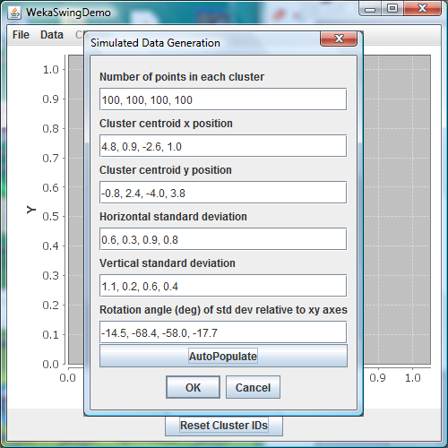
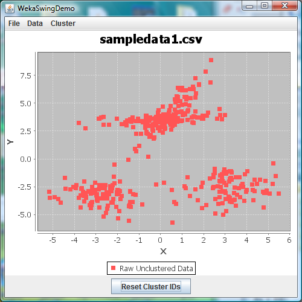

Weka Swing Demo
===============

Purpose
-------

This is a demo project. It contains the source code for a very small, limited functionality desktop GUI application which implements a handful of data clustering algorithms from Weka, a well-known machine learning and data mining package_ written in Java.

As a demo app, it's not actually intended to provide a "serious" tool which could potentially be adopted by some hypothetical base of end users. Indeed, the Weka team has already provided their own GUI interface to their system, and an alternative interface isn't really needed.

Instead, the purpose is to improve a shortcoming in my own online project portfolio: historically, for about the last decade or so and up until quite recently in my career, I've been employed mostly in closed source environments. As a result, most of my best work has ended up locked away in various vaults at my previous employers.  This project was therefore conceived as a limited commitment, modestly scoped but still reasonably substantive effort by which I could show my capabilities to the world both as a Java coder and a Weka user.

.. _package: http://www.cs.waikato.ac.nz/ml/weka/

Required External Third-Party Packages
--------------------------------------

The project relies upon two external Java libraries, each freely available for download, with its own documented external API:

* Weka_ (used version 3.6.9, documented both via included pdf manual as well as in JavaDoc_; provides clustering algorithms)
* JFreeChart_ (used version 1.0.15, documentation available here_; performs all plot-related operations) 

In addition, the source itself code was developed using Eclipse_, with much of the layout designed through the WindowBuilder plugin.

.. _Weka:        http://www.cs.waikato.ac.nz/ml/weka/downloading.html
.. _JavaDoc:     http://weka.sourceforge.net/doc.stable/
.. _JFreeChart:  http://sourceforge.net/projects/jfreechart/files/
.. _here:        http://www.jfree.org/jfreechart/api/javadoc/index.html
.. _Eclipse:     http://www.eclipse.org/downloads/

Package Contents
----------------

The files comprising this package are organized into the following tree structure:

========================================  ====================================
                  Name                                 Description
========================================  ====================================
``.settings``                             Eclipse user settings
``.settings/org.eclipse.jdt.core.prefs``  Eclipse user preferences
``data``                                  Example data
``data/sampledata1.csv``                  Simple two-column example
``screenshots``                           Captured screen photos
``screenshots/clustereddata.png``         Example data points which have all been assigned to cluster IDs
``screenshots/datagen.png``               Popup window for generating simulated data
``screenshots/rawdata.png``               Example data points which have not yet been operated upon by the clustering algorithms
``src``                                   Project source code
``src/DataGenPane.java``                  Popup window for generating simulated data
``src/WekaSwingDemo.java``                Main GUI frame and components
``.classpath``                            Directory locations on my local machine of various build-related items needed by Eclipse (external libraries, etc.)
``.gitignore``                            Avoids tracking/uploading compiled binaries
``.project``                              XML file autogenerated by Eclipse that encodes project build instructions
``README.rst``                            This README file
========================================  ====================================

Try It Out!
-----------

If you don't want to or can't compile the java source code yourself, you may download_ a precompiled Java .jar executable together with a very simple test data file.

.. _download: https://app.box.com/s/8vqbqamh3arm5eyo8hvj
  
As a demo application, the GUI has limited functionality. In fact, it really only does one thing: it calculates cluster membership for two-dimensional demo data sets.

To operate the demo, just choose ``File -> Open`` from the drop down menu, and open the included two column ``sampledata1.csv`` example data file (or for that matter, any other data file which has been similarly formatted). The raw data will be plotted in the chart panel, and after that, you may run any of the three included cluster algorithms: just choose whichever option you prefer from the ``Cluster`` menu.

Aside from opening a data file and running a Weka clustering algorithm, there are really only three other things that you can do:

* Pressing the ``Reset Cluster IDs`` button will cause the application to erase whatever cluster memberships it had previously calculated for the data points.
* Selecting ``Data -> Generate`` will give the option of generating simulated data; press the ``AutoPopulate`` button and then the ``OK`` button in order to see what the correct input format looks like as well as what output it generates.
* Selecting ``File -> Save as`` will save whatever data set is currently in memory; if the data includes calculated cluster memberships as well then it will be saved in a three column format instead of the usual two columns.

Screenshots
-----------
In typical operation, the GUI demo application looks like the figures below:

Simulated data can be generated artificially using the data generation popup window.

When it's initially loaded, raw unclustered data looks like this.

.. figure:: screenshots/clusterddata.png

Select various Weka clustering algorithms from the ``Cluster`` menu in order to calculate the cluster membership of each data point.

Maintenance and Contact Information
-----------------------------------

| *Author*: Andrew L. Stachyra
| *Email*:  andrewlstachyra@gmail.com
| *Date*:   August 30, 2013